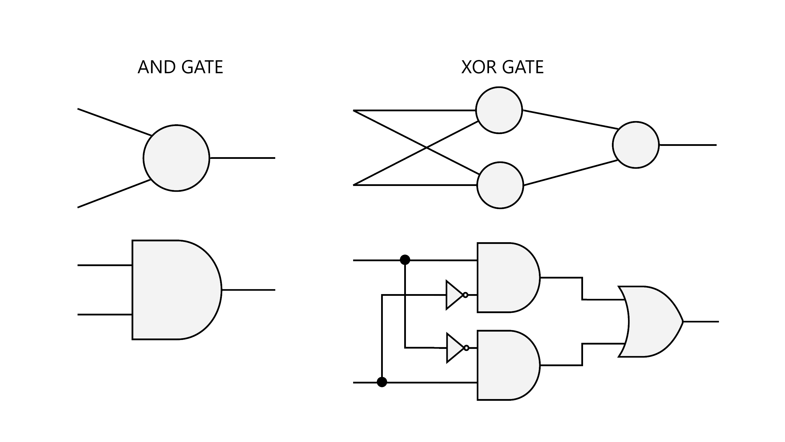
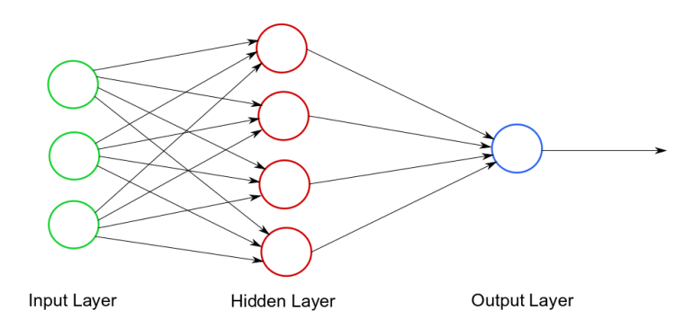

# Neural-Net
A simple Neural Network made in Java.

## How the Perceptron works
A **Perceptron** is an "artificial neuron" which simply receives some inputs, and returns some outputs.
Normally those outputs are wrong, but through a long **learning process** the Perceptron starts correcting those outputs.  
Then, once the Perceptron starts getting better results, we can give him a new totally different **new situation** and it should  get it right. 

### But how does the Perceptron gives us an output?
To understand how the Perceptron "thinks" we need to know how is a Perceptron.  
A Perceptron has:
- **Inputs**: They are normally *n* numbers in an **array** or a **matrix** which represent different things, for example the data collected from the weather.
- **Output**: This is one number that should correspond to the **Inputs**.
- **Synapses (or weights)**: These are *n* numbers that **"add a weight"** to the Inputs to generate an output.

The **Weights** will determine how the Perceptron is calculating the **Output**. But how, *"our Perceptron needs to learn to do this by itself"* we only will tell him how to correct these **Weights**.  
At the beginning it doesn't matter how these **Weights** are initialized because, if we compare this perceptron to a new born baby, we don't know how the baby will react to new information. So our Perceptron will work the same way, at the start we can **initialize this values at random**.  
 
To generate an **Output** the Perceptron does the *weighted sum* of the multiplications between the inputs and the weights.  
`X1*W1 + X2*W2 + ... + Xn*Wn`  

But if you do this math, the output probably won't be in the range of numbers we need, so we will need something called an **Normalizing Function**.

### Normalizing Function
An **Normalizing Function** (*also called Activation Function*) is a function that normalizes the value given to a different range.
We will use a Normalizing Function called the **Sigmoid Function**, this function is used for binary numbers because it receives a value, and transform it to another value in the range of 0 and 1. The **Sigmoid function** is as follows:  
`sigmoid(x) = 1 / [1 + exp(-x)]`

## Training
Now that we know how the Perceptron works we could try it and it should give us an Output. But this Output, probably won't be right, because our Perceptron is calculating it through random weights. So we will tell the Perceptron how to **adjust these weights** through a process called **Training**, so every time we ask  for a new situation the Perceptron will get better and better.  

The first thing we need to do to **Train** the Perceptron is calculate the **error**. The error is *the difference between the real output, and the output given by the Perceptron*. We need to calculate this for every output.  
`error = actualOutpur - output`  

Once we have the error, we can adjust the weights with a formula called the **Error Weighted Derivative**. That looks like this:  
`adjustments = error * inputs`

### Learning Rate
But we can also add another value to control the slope of the adjustments. We will call this value **Learning Rate**.  
The **Learning rate** usually is a value between 0 and 1. For example if our value is 0.5, the correction of the weight will be the half of the error. This helps to avoid big jumps in the weights.  
We will the **Sigmoid Derivative** for this. which is as follows:  
`sigmoidDerivative(x) = x * (1 - x)`  
This function receives the outputs given by the Perceptron and helps the weights to be less adjusted the closer they are to the correct value.  

So our correction or adjustments should be calculated this way:  
`adjustments = error * inputs * sigmoidDerivative(output)`  
We add these adjustments to the weights. And now our weights will get a slightly better output.

### Bias
You may have noticed that the weighted sum of the Perceptron won't always work.  
For example, if we take (0, 0, 0) as our inputs, when the Perceptron multiplies this values by its weights, the output will be always 0. But what if we wanted the output to be 1? To correct  this problem we need a **Bias**.  
A **Bias** is an additional input (whit his correspondent weight) that always have the value of 1. That way when we do the following operation:  
`X1*W1 + X2*W2 + X3*W3 + 1*B1`  
Our output won't have this problem, because *B1* will be a new weight that helps the output not to get stuck.

### Repeat
This process won't work the first time, nor the second or the third. Like us, machines need time and practice to learn new things. This whole process will need to be repeated thousands of times to work, for example 20000 times.  
This is what we call **Machine learning**. The machine:
- Receives inputs.
- Processes them.
- Generates an output.
- Calculates the error.
- Adjusts itself.
- And repeat...

## How a Neural Network works?
If we know how a Perceptron works, it's now too hard to understand how a **Neural Network** works. Because a Neural Network is just *a collection of connected nodes (Perceptrons)*.  
The benefit of creating Neural Networks instead of simple Perceptrons is that with these, we can solve harder problems. For example, before we could teach the Perceptron to solve an AND or an OR gate, but if we tried to teach the Perceptron
a more complex operation like XOR it wouldn't work.  
As you can see in the next image, this is because a XOR gate requires two AND gates and one OR gate.

  

This problem is too difficult for just one Perceptron.
So we can solve this problem creating a Neural Network with three neurons, this way the net can train the first two as AND gates, and the third as an OR gate.  

### Layers
A Neural Network made up of various layers. Each layer also has a group of Perceptrons.
The first layer is called the **Input Layer** because is the one that receives the inputs from the dataset. The last layer is called **Output Layer**, this is because is the layer that gives the final output. Every layer between these two are called **Hidden Layers** and are the ones responsible to generate the outputs.  

## References
- PolyCode - Create a simple NN: https://youtu.be/kft1AJ9WVDk && https://youtu.be/Py4xvZx-A1E
- The Coding Train - Neural Network Playlist: https://www.youtube.com/playlist?list=PLRqwX-V7Uu6Y7MdSCaIfsxc561QI0U0Tb
- The Coding Train - Intelligence Learning: https://github.com/nature-of-code/NOC-S17-2-Intelligence-Learning/tree/master/week4-neural-networks
- *Make your own Neural Network* - book by *Tariq Rashid*